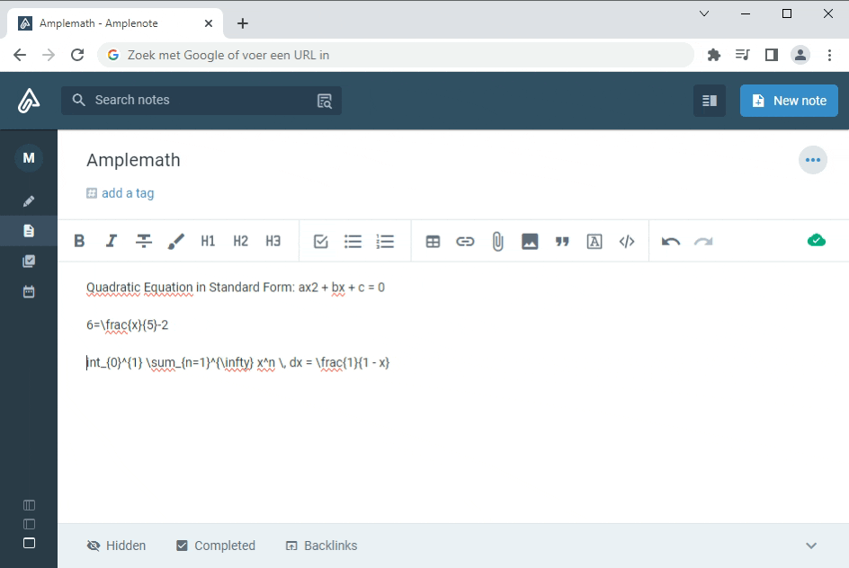

| | |
|-|-|
|name<!-- {"cell":{"colwidth":111}} -->|Amplemath<!-- {"cell":{"colwidth":1416}} -->|
|icon<!-- {"cell":{"colwidth":111}} -->|functions<!-- {"cell":{"colwidth":1416}} -->|
|description<!-- {"cell":{"colwidth":111}} -->|Transform text into beautifully formatted mathematical equations with LaTeX, directly from your notes.<!-- {"cell":{"colwidth":1416}} -->|
|instructions<!-- {"cell":{"colwidth":111}} -->|[^1]|
### Plugin code:

```
{
  replaceText: {
    "convert to Math": async function(app, formulaText) {
      const replacedSelection = await app.context.replaceSelection(await this.image(formulaText));
      if (replacedSelection) {
        return null;
      } else {
        return "error";
      }
    }
  },
   async image(formulaText) {
     // URL encode the formulaText string to ensure it's safe for URL
     formulaText = encodeURIComponent(formulaText);
     return ``;
  }
}
```

\

Version History

- v0.1.0

[^1]: 
    

    # **Amplemath Plugin Help**

    **Introduction:**\
    Enhance your Amplenote experience with seamless LaTeX support. With Amplemath you can incorporate complex mathematical equations, symbols, and formulas effortlessly into your notes.\
    \
    **About LaTeX:** LaTeX is a typesetting system commonly used for creating documents containing intricate mathematical and scientific content. It's known for its ability to produce polished and professional-looking output, making it a favorite among academics, researchers, and technical writers.

    **\
    Getting Started:**

    1. **Installation:** Before using the Amplemath plugin, ensure that you have it installed in your Amplenotes application.

    1. **Activation:** Once Amplemath is installed, make sure it's activated in your plugin settings. This will enable the plugin's functionality within the Amplenotes environment.

    **Using Amplemath:**

    1. **Select Text:** Within your notes, select the text you want to convert into a mathematical expression.

    1. **Context Menu:** In the context menu, click on the option labeled "Amplemath: convert to Math" to convert your text into beautifully formatted mathematical expression.

    **LaTeX Syntax:** To ensure accurate and reliable conversions, Amplemath uses LaTeX syntax for mathematical expressions. LaTeX is a typesetting system commonly used for creating scientific and mathematical documents. It provides a flexible and consistent way to represent mathematical notations. If you're not familiar with LaTeX, don't worry! You can learn more about LaTeX syntax and how to use it from the official LaTeX documentation: **[LaTeX Official Documentation](https://www.latex-project.org/help/documentation/) **

    **\
    Example:** \
    Suppose you have the following text selected in your Amplenotes: "x^2 + y^2 = r^2" After using Amplemath, the text will be converted to the corresponding mathematical expression: .

    **Tip: Preview Your Formulas and LaTeX Syntax:** you can use online LaTeX formula previewers to see how your equations will appear and verify your LaTeX syntax. Various websites offer this service, including **[this LaTeX preview website](https://www.codecogs.com/latex/eqneditor.php)**, which can help you visualize and validate your mathematical expressions written in LaTeX.

    **Credits:**\
    Amplemath utilizes the capabilities of the **[math-api](https://github.com/uetchy/math-api)** project to render the mathematical expressions and bring its capabilites to Amplenote. For more details about **math-api**, please explore its **[GitHub repository](https://github.com/uetchy/math-api)**.\
    \
    **Version History:**\
    v0.1.0 - Initial release

