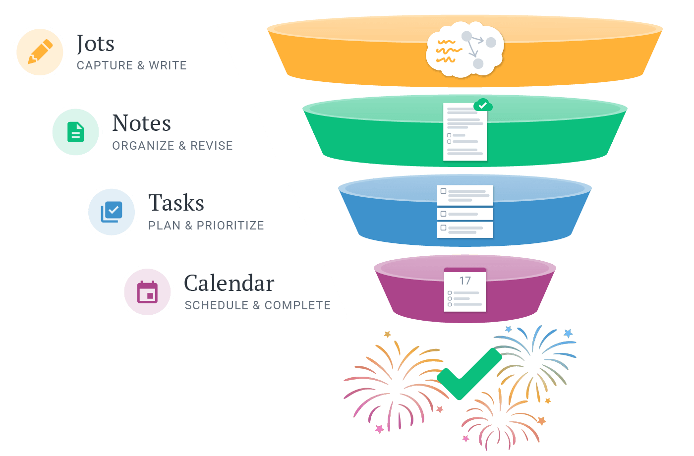
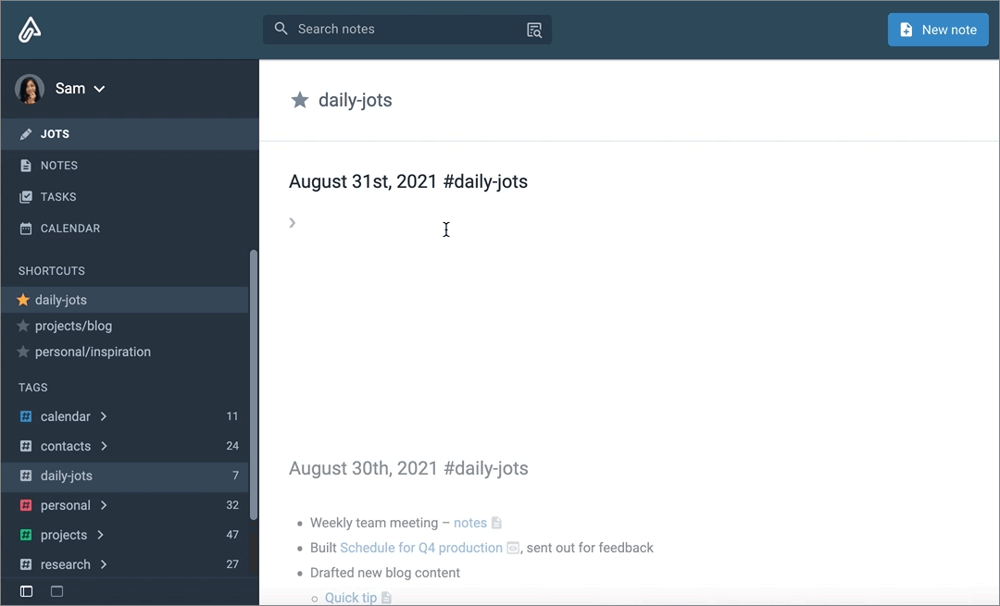
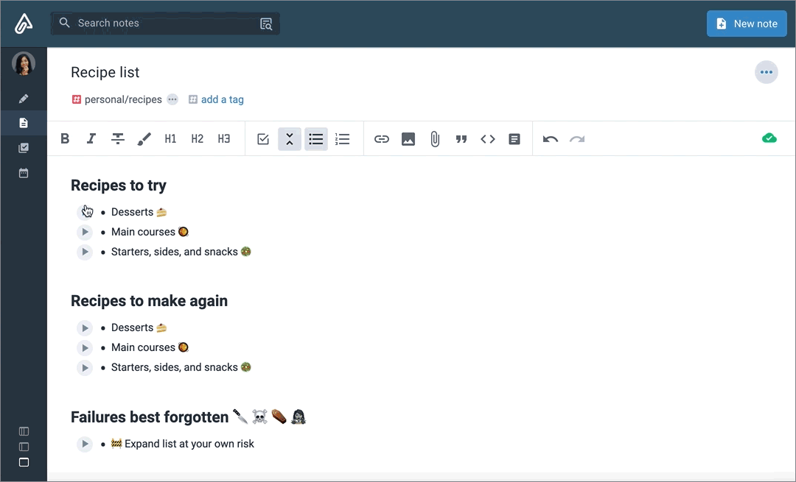
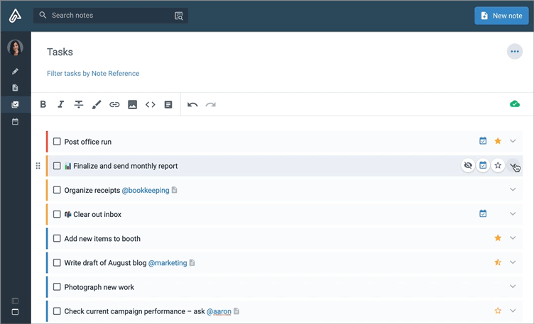
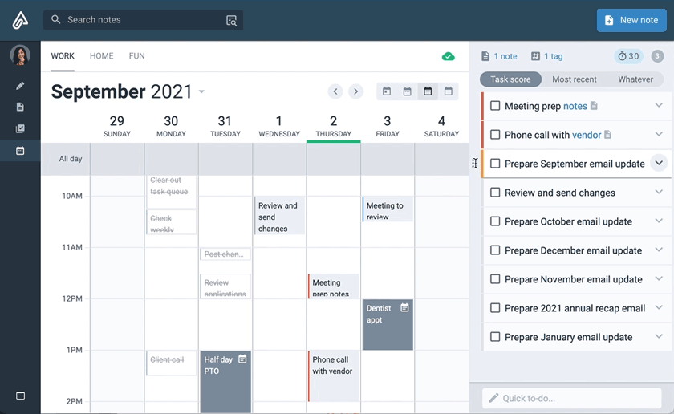
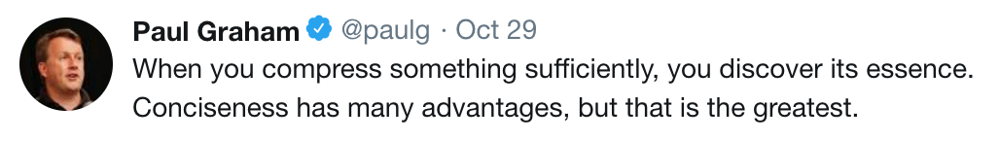

Welcome to Amplenote!

\

**The least to know about Amplenote** is that all functionality is split between four modes: **Jots**, **Notes**, **Tasks** and **Calendar**. You can read more about each below. On desktop, you switch between these modes in the upper left of your screen. On mobile, the four modes are visible at the bottom of your screen whenever you open the app (or by clicking the icon in upper right).

\

The modes combine to form what we call "[the Idea Execution Funnel](https://www.amplenote.com/blog/jots_unify_four_apps_ideas_into_idea_funnel)," a framework for how we suggest using Amplenote:

\

\

 [^1]
> *Idea Execution Funnel: try to capture everything, only the best stuff makes its way to Tasks and Calendar*

\

If you previously used another app, Amplenote supports importing from [Evernote](https://www.amplenote.com/help/import_from_evernote_how_to#How_do_I_import_from_Evernote?), [Roam](https://www.amplenote.com/help/import_from_roam#), [Notion](https://www.amplenote.com/help/importing_from_notion), [Google Keep](https://www.amplenote.com/help/import_from_google_keep), or [markdown files](https://www.amplenote.com/help/import_from_markdown). 

\

Once you're up and running you can access your notes anywhere -- including offline support -- on unlimited devices ([iOS](https://apps.apple.com/us/app/amplenote/id1436769674), [Android](https://play.google.com/store/apps/details?id=com.amplenote&hl=en), [desktop app](https://www.amplenote.com/help/installing_amplenote_macos_windows_linux_ios_android#)).  🎉  

\

[Learn how to install our iOS, iPad and Android mobile widgets here](https://www.amplenote.com/help/mobile_ios_android_widgets_tasks_agenda_calendar). We've got many to choose from.

\

[**Download Amplecap**](https://www.amplenote.com/help/amplecap_browser_extension_guide), our free all-in-one web clipping extension that lets [you simultaneously capture **screenshot** + **URL** + **annotations** + **date of capture**](https://twitter.com/williambharding/status/1630483903466328067) here.

\

# 💪 Top 3 productivity boosters

1. Visit the [**Amplenote Plugin Directory**](https://www.amplenote.com/plugins), and consider installing the free [Amplenote OpenAI](https://www.amplenote.com/plugins/75h72w8xghmHDdr8p5FiX6fh) or [Image Creator](https://www.amplenote.com/plugins/ZHFuNCcC8fAmZRjhKhDHjGcW) plugins, which connect your notes to GPT-4 for contextual thesaurus suggestions, grammar check, and much more.

1. Consider following our [**Twitter**](https://twitter.com) and [**Discord**](https://discord.gg/nAj4wp4sJm) accounts, where we make announcements about product upgrades every week or so

1. [**Sync your external calendar(s) to Amplenote**](https://www.amplenote.com/help/connect_a_calendar) so you can drag-and-drop your daily schedule from your sorted tasks, and have it available everywhere

\

---

\

# 📓 The four Amplenote view modes

With Amplenote, "reading the instructions" is always optional. We have tried to design our app to be simple enough that it works the way you expect, even if you don't have time to study it. That said, you might get up to speed more quickly by learning the basics of the four view modes we offer.

## **Jots:** Capture & Write

\

\

Jots allow you to quickly capture ideas and information with minimal distractions. A new jot is created each day, ready for you to log activity or inspiration. You can work in the the default `#daily-jots` tag or select a different tag from the sidebar to create daily notes for specific topics.

\

See how Jots can be used to journal activity and plan your day in [this video](https://www.youtube.com/watch?v=ThCwUvTOadM) 

\

**Try it out:** 

\

---

## **Notes:** Organize & Revise

\

\

Move to Notes mode when you are ready to edit, organize, and publish content. This is where you can refine content, view completed tasks, and view backlinks to related notes. You can also add collaborators to notes and secure you notes with Vault encryption (Unlimited and Founder plans only).

\

See an overview of Notes mode and tags in [this video](https://youtu.be/W-g9DENSDU0?t=851) 

\

**Try it out:** 

\

---

## **Tasks:** Plan & Prioritize

\

\

While every task lives in a note, in Tasks mode you can view open tasks across all notes and narrow the list by applying filters. Expand the task details to assign urgency, change the recurrence, hide the task until later, and more. Task scores update as the properties change so you can surface the top priorities and identify what to work on next.

\

See some ways that we use Tasks mode in [this video](https://www.youtube.com/watch?v=L6NqWJWgYyw). 

\

**Try it out:** 

\

---

## **Calendar:** Schedule & Complete

\

\

In Calendar mode you can build out your schedule with maximum ease and efficiency. Set up different task domains to pull content from separate source notes and external calendars. Unscheduled tasks from the domain's source notes are listed in the sidebar, ready to be added to the calendar with a simple drag and drop.

\

See how you can drag-and-drop tasks to your schedule in[ this video](https://www.youtube.com/watch?v=SmgU6XNlknA). 

\

**Try it out:** 

\

---

\

Learn more about using Amplenote by visiting our [YouTube channel](https://www.youtube.com/channel/UCBn94L66MVFECGt7nWHO0cw) and the [Help & Learning Center](https://www.amplenote.com/help) .

\

To stay up to date on product additions and improvements follow us on [Twitter](https://twitter.com/amplenote). 

# Completed tasks<!-- {"omit":true} -->

- [x] Add a task by typing `\[\]` then space. <!-- {"uuid":"3a7644d9-f80e-4771-8cef-94e9e0f5ddb5"} -->

- [x] Navigate to Jots mode in the sidebar and enter some text to create a Jot. <!-- {"uuid":"25d35191-dcfd-4f36-adc7-232e4cdf9adb"} -->

- [x] Connect your Google or Outlook account and link calendars to task domains. All users can import scheduled events while a Pro subscription or higher allows you to publish Amplenote tasks to your external calendar.<!-- {"uuid":"2245c2b0-03ca-4f84-a914-c1258266f09f"} -->

- [x] Navigate to Tasks mode and change the sort order by clicking on the triple-dot menu.<!-- {"uuid":"1cde33ac-6b17-4ce7-b929-84f94bca8ec5"} -->

- [x] Click on an empty time slot in the calendar to create a new task.<!-- {"uuid":"28b561ad-9fc0-4461-aeb3-34cc4fab5a5b"} -->

- [x] In the Calendar mode schedule a task by dragging it from the right sidebar to the calendar.<!-- {"uuid":"91cf0695-af31-4837-8fa7-b17c77568e3f"} -->

- [x] Add a tag to a note (and [view some tips](https://www.amplenote.com/help/five_recommendations_tag_hierarchy_naming) for organizing and structuring tags).<!-- {"uuid":"e56a49fe-fd9d-4551-a538-536b43892cb6"} -->

- [x] Visit your [calendar settings](https://www.amplenote.com/task_calendar) and assign source notes or tags to each task domain.<!-- {"uuid":"2c1d0d6b-5a25-4f40-907b-5d1ce66fe11b"} -->

- [x] Scroll to the bottom of the note to view tabs listing completed tasks and backlinks to related notes.<!-- {"uuid":"a74cd870-efce-4b59-9d56-cb876f0c392f"} -->

- [x] In the sidebar select "High value" to only show tasks with a score of 10 or higher.<!-- {"uuid":"74ef08b0-5eae-4fb9-b9e6-58c405db66c1"} -->

- [x] Create a [backlink to another note](https://www.amplenote.com/help/backlinking_bidirectional_linking) by typing double brackets `\[\[` then creating a new note or searching through existing. <!-- {"uuid":"75ed21c1-7a26-ee40-dcb1-e9c65c7b2682"} -->

- [x] Create a [Rich Footnote][^2] by selecting text and typing `ctrl` + `k` (Mac: `⌘` + `k` ). <!-- {"uuid":"72d2c01c-7b70-4781-9bd3-3e51edb3abf0"} -->

- [x] Click the expander button at the right of this task and change the properties of this task -----------------><!-- {"uuid":"c34134f2-22fe-c845-d59e-2744369ce34b"} -->

[^1]: Jots
    CAPTURE & WRITE
    v
    Notes
    O
    ORGANIZE & REVISE
    O
    Tasks
    O
    PLAN & PRIORITIZE
    Calendar
    17
    000
    SCHEDULE & COMPLETE

[^2]: [Rich Footnote](https://www.amplenote.com/blog/writing_in_3d_how_the_writing_method_impacts_thinking)

    Rich Footnotes are the heart of how Amplenote intensifies the force of your ideas. They compress information into its most concise representation, helping you to capture the essence of the idea.

    

