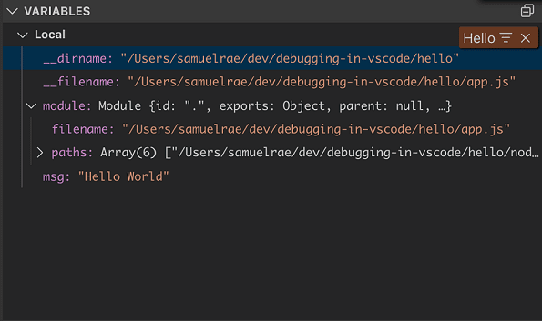

# Debugging (backend)

Debugging a backend application is a little different than debugging a frontend application. Since it is not running within a browser a debugger needs to be used. Normally a backend process is started within a terminal window which will start a process that runs the application. When debugging this is also the case, but the application is run in a debugger terminal which will attach a debugger to the process. This provides the functionality to pause if the process comes across some code that has been tagged with a breakpoint within the debugger. This is in a simple way how debugging with a tool like VSCode works.

## VSCode

After running a process and attaching a debugger the features are very similar to the debugger used for frontend applications. You can stop at a breakpoint and see what values are assigned to which parameters and state. This looks something like this

 [^1]

[^1]: V VARIABLES
    Local
    Hello = X
    _dirname: "/Users/samuelrae/dev/debugging-in-vscode/hello"
    filename: "/Users/samuelrae/dev/debugging-in-vscode/hello/app. js"
    module: Module fid: ".", exports: Object, parent: null, ..}
    filename: "/Users/samuelrae/dev/debugging-in-vscode/hello/app.js"
    > paths: Array(6) \["/Users/samuelrae/dev/debugging-in-vscode/hello/nod..
    msg: "Hello World"

