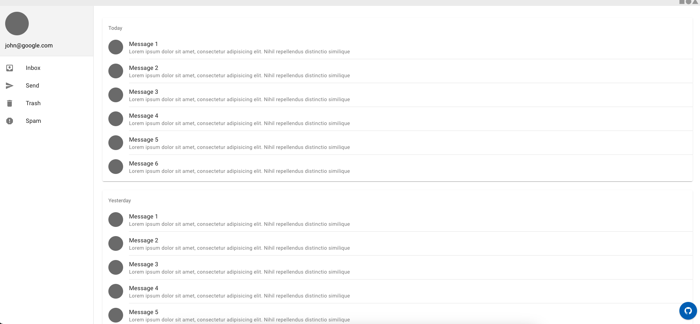

# Material design

Material design is my favourite framework when I do not want to spend too much time thinking about how I want my application to look. Material design was made by Google and follows their design principles which makes it look very familiar and usable.

I would not recommend using material design when trying to create a visually unique application. I use it mostly when working on business side applications where usability is more important than making it pretty. While the design of material design is visually attractive it looks very much like a google page, so not unique;

It kind of depends what use cases you work with. For the use case where you are making software that is used internally by a business it is perfect! You will be done quickly by using the custom components and it will look good. Here is an example of a page design by material design.

 [^1]

Basic design with material design

Material design also has a lot of versions made for the most popular frameworks like `Vuetify` for `Vue` and `Mui` for `React`. I think Vuetify’s design principles describe it’s usage best

> Vuetify is a no design skills required UI Library with beautifully handcrafted Vue Components.

My own personal [website](https://vonkprogramming.nl) has also been made with Vuetify.

Source: [https://vuetifyjs.com/en/](https://vuetifyjs.com/en/)

[^1]: Today
    john@google.com
    Message 1
    Lorem ipsum dolor sit amet, consectetur adipisicing elit. Nihil repellendus distinctionsimilique
    Inbox
    Message 2
    Lorem ipsum dolor sit amet, consectetur adipisicing elit. Nihil repellendus distinctionsimilique
    Send
    Message 3
    Trash
    Lorem ipsum dolor sit amet, consectetur adipisicing elit. Nihil repellendus distinction similique
    Message 4
    Spam
    Lorem ipsum dolor sit amet, consectetur adipisicing elit. Nihil repellendus distinctionsimilique
    Message 5
    Lorem ipsum dolor sit amet, consectetur adipisicing elit. Nihil repellendus distinctionsimilique
    Message 6
    Lorem ipsum dolor sit amet, consectetur adipisicing elit. Nihil repellendus distinction similique
    Yesterday
    Message 1
    Lorem ipsum dolor sit amet, consectetur adipisicing elit. Nihil repellendus distinctionsimilique
    Message 2
    Lorem ipsum dolor sit amet, consectetur adipisicing elit. Nihil repellendus distinctionsimilique
    Message 3
    Lorem ipsum dolor sit amet, consectetur adipisicing elit. Nihil repellendus distinction similique
    Message 4
    Lorem ipsum dolor sit amet, consectetur adipisicing elit. Nihil repellendus distinctionsimilique
    Message 5
    Lorem ipsum dolor sit amet, consectetur adipisicing elit. Nihil repellendus distinctionsimilique

