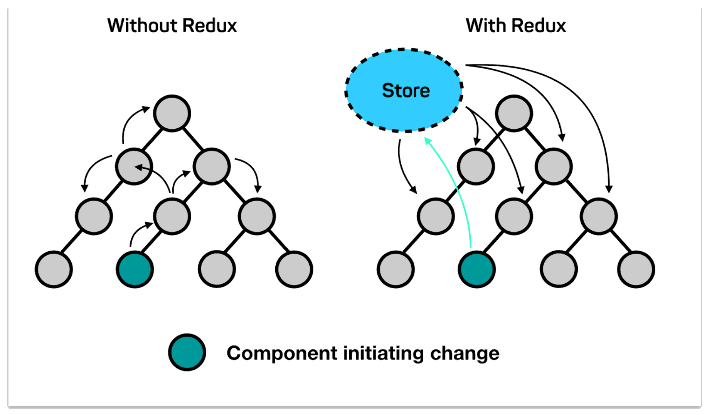
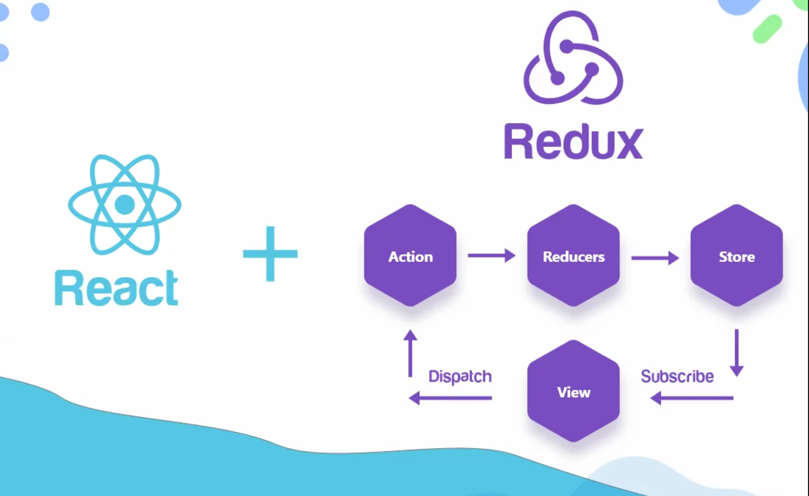

# State management

State management within most frameworks function with a trickle way of thinking. This means that for a root component to provide some data to a child of a child the data has to pass through two components. Within this specific example this still works but within bigger applications this can become a real mess. Think about pushing a refresh button in a filter list component which has to emit an event to the parent which loads the data and then has to trickle it down two components to provide the data, that’s a mess. Here is a diagram to show what this means

 [^1]

Difference between redux and non-redux applications

For this purpose Redux is used. There are also other implementations of redux but this is with head and shoulders the way to do state management in a separate container right now.

## How it works

Redux works by letting component subscribe to the store with specific data they need from the store. Then actions can be dispatched to the store which trigger some logic and then change some data using the reducer. When data is changed with a reducer redux notices this and alerts all the components that subscribed to that data that data has changed and they should rerender their DOM. And that’s basically it!

 [^2]

How redux handles data

## How to use

Like explaind before to create a store we need **actions**, **reducers** and a **store**. To do this first we need to install the `redux` or the `@reduxjs/toolkit` dependency and start by creating a simple reducer which creates a store like this. The current preffered way is using the `@reduxjs/toolkit` dependency since this handles a lot of things for you and creates a better overview of what your store actually does.

```tsx
import { createSlice, configureStore } from '@reduxjs/toolkit';

const usersSlice = createSlice({
	name: 'users',
	initialState: {
		data: []
	},
	reducers: {
		setUsers: (state, action) => {
			state.data = action.payload;
		},
		addUser: (state, action) => {
			state.data.push(action.payload);
		},
		removeUser: (state, action) => {
			state.data.splice(action.payload, 1);
		},
		updateUser: (state, action) => {
			state.data.splice(action.payload.index, 1, action.payload.user);
		}
	}
});

export const { setUsers, addUser, removeUser } = usersSlice.actions;

const usersReducer = usersSlice.reducer;

export default configureStore({
	reducer: {
		users: usersReducer
	}
});
```

Now this is an example of how to create a store, but there is one part that is forgotten, how to use it within a component! Let’s first see how to receive data from the redux store within a react application (other frameworks work as well).

```tsx
import { useSelector } from 'react-redux';

export function UsersList() {
	const users = useSelector(state => state.users.data);

	return (
		<ul>
			{ users.map(user => (
				<li>
					{ user?.name }
				</li>
			)) }
		</ul>
	);
}
```

Now that was easy and now the component will get updated once an action is called that would change the data. Next we need to call an action to change the data in the store so the example above can receive the data.

```tsx
import axios from 'axios';
import { useEffect } from 'react';
import { useDispatch } from 'react-redux';

import { setUsers } from '../store/index.js';
import UsersList from '../components/UsersList.jsx';

export function UsersPage() {
	const dispatch = useDispatch();

	useEffect(getUsers, []);

	async function getUsers() {
		const { data: users } = await axios.get('/api/users');
		dispatch(setUsers(users));
	}

	return (
		<div>
			<UsersList />
		</div>
	);
}
```

This can of course also be expanded to update users by using a selector to get data and then updating this specific data and dispatching an action, this more advanced example would look something like this

```tsx
import { useState } from 'react';
import { useDispatch, useSelector } from 'react-redux';

import { updateUser } from '../store/index.js';

export function UserForm({ match }) {
	const { id: userId } = match.params;
	const dispatch = useDispatch();

	const user = useSelector(state => 
		state.users.data.find(user => user.id === userId)
	);

	const [name, setName] = useState(user?.name);
	const [dateOfBirth, setDateOfBirth] = useState(user?.dateOfBirth);

	function updateUser() {
		updateUser({ 
			id: userId,
			user: { name, dateOfBirth }
		});
	} 

	function handleInput(e) {
		if(e.target.name === 'name') {
			return setName(e.target.value);
		}
		if(e.target.name === 'dateOfBirth') {
			return setDateOfBirth(e.target.value);
		}
	}

	return (
		<div>
			<input type='text' name='name' value={user.?name} onChange={handleInput} />
			<input type='text' name='dateOfBirth' value={user?.dateOfBirth} onChange={handleInput} />

			<button onClick={updateUser}>Save</button>
		</div>
	);
}
```

### 

[^1]: Without Redux
    With Redux
    Store
    oo
    O
    O
    O
    O
    Component initiating change

[^2]: Redux
    +
    Action
    Reducers
    Store
    React
    -
    Dispatch
    Subscribe
    View

