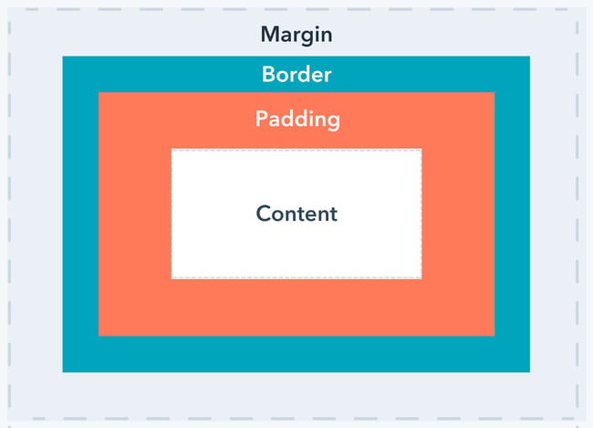

# Stylesheets

After having worked with CSS for a while I still keep learning new things. I am personally more of a fan of using component libraries that make you write as little CSS as possible but in some instances your interface has to be custom so custom CSS has to be written. After some of these projects I have learnt some good practises and how to manipulate the DOM the right way. I will go through all these lessons and best practises in each separate chapter

## Position content

Position within CSS is done with the `position` keyword. The keywords I use most are

- `relative` position the element within the normal flow of the document with defined relative position to the normal flow

- `absolute` position the element within the closest parent at the top (a parent can be a `relative` or an `absolute` element), this is handy when you want to place some content somewhere specific without paying any mind to other content

- `fixed`position fixed to viewport

In most cases it is best to use relative since this takes up space within your page. This is handy because if there is content after it can take into account how much space the element before it is taking up. For instance if you are rendering a list within an element with position relative the element after it will adjust if the element grows, if the element is set as absolute this will not happen.

In the case where you want to place an element specifically somewhere without it taking into account other elements like a button on the top right of a card you can use `absolute`. When using `absolute` is common to set the `top` or `bottom` or `left` or `right` to `0` to bind it to one side of the parent element. But this is not always the case sometimes you want to center the element, this can be be done by using `50%` and then using the `transform: translate` function like this

```css
.error-modal {
	position: absolute;
	top: 20px;
	left: 50%;
	transform: translateX(50%);
}
```

this sets the element to start from `50%` and then translate how it is display by moving it `50%` of it’s own size to the left centering the element, this can also be done with `top` and `translateY`

Finally `fixed` is used for fixing some content to the viewport, this is mostly used for a navbar.

## Spacing

To define the size of an element there are a couple of things to consider the actual `height` and `width` of the element, the `padding`of the element, the `border` and the `margin` . These will be placed like this

 [^1]

For example if you have a card the content will be where the text lives, the padding will be the whitespace between the content and the border, the border will distinguish the card from the rest of the dom by adding a line and the margin will be space between the border and the other elements in the DOM.

This is all very self explanatory but margin, height and width have some extra logic attached to them so I will give them their own sub chapter

### Margin

Aside from setting margin with a specific value (px, em, rem) it can also be set to `auto` this is nice if you want to center an element. If the width is set on an element with a position of relative if the `margin-left` and the `margin-right` are set to auto this will center the element

### Sizes (height and width)

When sizing an element it is good practise to not only use `height` and `width` but also use the `max-width` and `min-height` keywords. These are handy for the following reasons

- `max-width` will not let the element exceed this size even with padding, this makes it so you can declare how wide you want the element to be and then set some padding between the border and the content without changing the actual width. This is mostly combined with `width: 100%;`

- `min-height` for height the minimal height setting is used more commonly to declare the minimal height of an element but to also scale with the content if it exceeds set.

`min-width` and `max-height` can also be used but these are used less commonly and perform the same as described above but with the opossite sizing.

## Display content

For displaying content in a certain way you can also set some values. This is used to define how to display content within an element. You do not always want to declare this yourself. There are a couple of simple ones and two which need their own sub chapter. The display settings that can be declared are

- `block` generates an element with a linebreak before and after the element

- `inline` generates an element without linebreaks

- `table` generates a table element, it’s better to use the HTML `<table>` element for this and style it accordingly

- `flex` generates an element with a `flexbox` inside which provide a lot of utilities to position elements inside (see subchapter)

- `grid` generates an element with a `grid` inside which provides ultilities for position elements within a grid

### Flex

Like explained before a flexbox provides a lot of utilities for placing your elements in a user friendly way this is done with `justify-content` and `align-items` and can also be changed from being in a row orientation to a column orientation with `flex-direction` the properties that can be used with a `display: flex` are

- `justify-content` defines how the items are distributed around the main axis

- `align-items` defines how the items are distributed around the secondary axis

- `align-content` defines how the items are distributed around the secondary axis if flex-wrap is enabed

- `gap` defines the gap between items

- `flex-direction` set the direction the content flows in, can be set to `row` or `column`

- `flex-wrap` sets if the elements can wrap around to create a new row or column, defaults to `nowrap`

These are the properties that can be set on the container itself some properties that can be set on the items are

- `flex` defines how much space the items can take up, defaults to `0 1` so if set to one will take up all the available space unless other element is also defined by `1` or higher

## Selectors

CSS knows a couple of seletors to select elements to set values on there are two shorthands I use for selecting elements and for all other I use the `\[attribute="value"\]` notation these are

- `.value` for classes

- `#value` for id’s

This looks something like

```css
.div-class-name {
	...
}

#div-id {
	...
}

[div-custom-attribute="attribute-value"] {
	...
}
```

## Media queries

Within CSS, media queries can be used to make a design responsive to create a media query looks something like this

```css
@media screen and (max-width: 430px) {
	.div-class-name {
		...
	}
}
```

The most important queries to know are

- `@media print` to create CSS specific for when printing

- `@media screen and (max-width: 430px)` for mobile design

- `@media screen and (min-width: 430px) and (max-width: 1024px)`  for tablet design

Read more at [https://www.browserstack.com/guide/ideal-screen-sizes-for-responsive-design](https://www.browserstack.com/guide/ideal-screen-sizes-for-responsive-design) 

[^1]: Margin
    Border
    Padding
    Content

