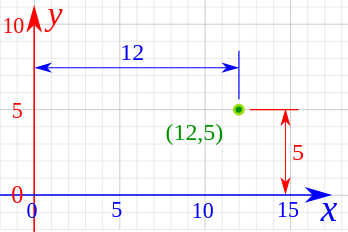
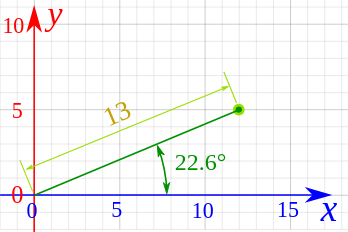

# Vectors

Vectors are a simple definition within mathematics which describe a direction and a magnitude for instance a car going 50 km/h eastwards is a vector. While a car going 50km/h without describing a direction is not a vector. Aside from two dimensional vectors there also exists multidimensionals vectors, these are called [matrices](Matrices.md).

[https://www.mathsisfun.com/algebra/vectors.html](https://www.mathsisfun.com/algebra/vectors.html) 

## Magnitude

To calculate the magnitude of a vector pythagoras theorem can be used. So basically the vector $a = (7,3)$ will result in a magnitudde of $\\sqrt{(7^2 + 3^2)}$ which will become $\\sqrt{(49 + 9)}$ which will become $\\sqrt{57}$. The magnitude is written with two vertical lines next to it like $\|\|x\|\|$

## Scalar

A scalar within vectors are a number that will be multiplied by the vector to scale it by that given amount. An easy way to think of this is the scale method within CSS. So if we have a vector with the values $\\begin{bmatrix}4\\5\\end{bmatrix}$ and we scale it by 2 it will become $2\\begin{bmatrix}4\\5\\end{bmatrix} = \\begin{bmatrix}8\\10\\end{bmatrix}$ so it scaled by times 2 and the vector got twice as long. This can also be done by floating point numbers or negative numbers to flip the vector or even scale it down.

## Polar and cartesian coordinates

There are two ways of describing a vector, using polar coordinates which use the length of the line with the angle it is at and cartesian coordinates which describe the X and Y increase. When describing polar coordinates $r$ is mostly used for the length of the line and $θ$ is mostly used to describe the angle. To simply describe this we’ll need images.

This is an example of cartesian coordinates

 [^1]

And this is an example of polar coordinates

 [^2]

To convert between these two the `tan` has to be used. To go from cartesian coordinates to polar coodinates the line length can be calculated using pythagoras theorem ($\\sqrt{x^2 + y^2}$) and the angle by

$tan(θ) = y / x$

So for a simple vector of a = (5,3)

The length of the line would be $\\sqrt{(5^2 + 3^2)} = \\sqrt{(25 + 9)} = \\sqrt{34}$

Then the angle of the line would be $tan(θ) = 3 / 5$ which is equal to $θ = tan^{-1}(3/5)$ = 33.963.

The other way around is a lot easier it goes as follow

- $x = r \* cos(θ)$

- $y = r \* sin(θ)$

[https://www.mathsisfun.com/polar-cartesian-coordinates.html](https://www.mathsisfun.com/polar-cartesian-coordinates.html) 

## Sum of vectors

Within math you will sometimes see $X = U ⊕ V$ which means that the vector X is the sum of a vector U and a vector V. But how to sum up vectors? This is actually quite easy when using the information given above. Lets say we have an example of two people pulling on an object with two ropes. John is pulling at an angle of 60 degrees with a power of 200N and Jeff is pulling at an angle of 40 degrees with a power of 180N. First we will need to calculate how much these vectors are so for John this will be

- $x = r \* \\cos(θ) = 200 \* \\cos(60) = 100$

- $y = r \* \\sin(θ) = 180 \* \\sin(40) = 173.205$

Jeffs vector will be

- $x = r \* \\cos(θ) = 180 \* \\cos(-40) = 137.888$

- $y = r \* \\sin(θ) = 180 \* \\sin(-40) = -115.702$

Which when added together will become

$(100, 173.205) + (137.888 + -115.702) = (237.888, 57.503)$

Which when calculated back will become

- $r = \\sqrt{237.888^2 + 57.503^2} = 244.739$

- $θ = \\tan^{-1}      ({57.503\\above{1pt}237.888}) = 13.589$

# Feature vectors

A feature vectors is a vector of one column but multiple rows. It is used within machine learning since it lists a set of data points which can be used to do approximations.

# Isomorphism

Two vectors are isomorphic if they follow the same trajectory.

# Unit or non unit

A vector is a unit vector if it has not been scaled so it's scale is still 1.

[Matrices](Matrices.md) 

[Vector norms](Vector%20norms.md) 

[^1]: 10Ay
    12
    5
    (12,5)
    5
    5
    10
    15
    X

[^2]: 10Ay
    5
    13
    22.60
    5
    10
    15 X

