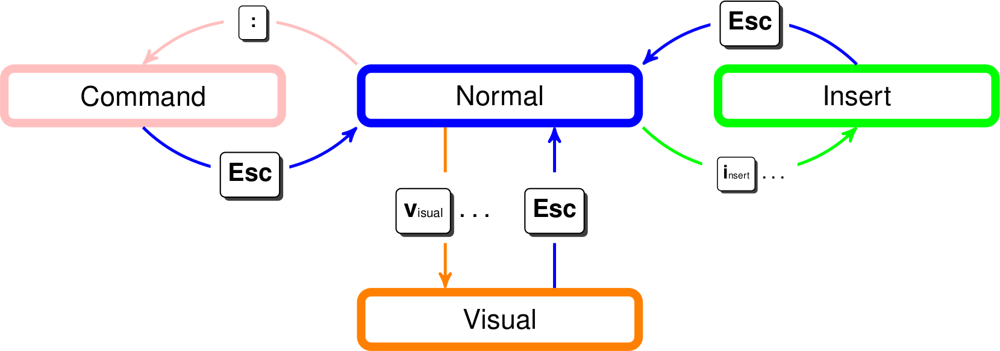

# Vim

## Summary

Vim is an IDE known for it’s steep learning curve and enormous amount of key bindings. This makes it very hard to pick up. But while researching the advantages a lot of fans of the IDE start to appear that have put in the effort to learn the key bindings and have achieved great productivity.

## Modes

Vim works with different modes

 [^1]

## Motions

Vim uses HJKL to move instead of the usual arrow keys this is done because it keeps your hand planted close to the other keys that you might need!

In the Vimtutor a lot of information can be found on how to use vim but here is a short summary of things that are good to know.

- One very powerful feature from Vim is the system with numbers for instance if you want to go 10 lines down you can first type the number 10 and then press k to move down 10 position! This also works with replace delete etc.

| | |
|-|-|
|Command|Description|
|0|go to start of line|
|^|go to first non blank character in line|
|$|go to end of line|
|w|go the start of next word|
|b|go to start of previous word|
|e|go to end of next word|
|E|go to end of previous word|
|dd|to delete / cut a line|
|dw|to delete / cut a word|
|u|undo last action|
|y|copy line|
|p|paste line|
|zz|center cursor in screen|
|zt|position cursor at top of screen|
|zb|position cursor at bottom of screen|
|a|to enter insert mode after the current character instead of on the current character|
|%|move to matching character like ( ), {}, \[\]|
|gg|to move to top of document or go to line when prepended with number|
|G|to move to bottom of document|
|v|highlight text from start to end which is also done with v|
|r|replace number of charaters|
|R|enter replace mode which replaces all characters the cursor moves over when typing|
|.|repeat last command|
|gt|Go to next tab|
|gT|Go to previous tab|
## Commands

Vim also supports commands which are used to write, exit, run commands etc. The classic joke how do I exit vim comes from this becaues the normal **ctrl + c** doesn’t cut it in vim here are the commands that are important to know

- \

| | |
|-|-|
|Command|Description|
|:w|write output to file|
|:q|safe quit|
|:wq|write and quit|
|:q!|force quit|
|:e|open new file in edit mode|
|/$(text)|search for text forward (cycle with n and N)|
|?$(text)|search for text backwards (cycle with n and N)|
|:!$(command)|run commands on system|
|:Exp(lore)|open file explorer|
|:Sex(plore)|split and open file explorer|
|:term|open terminal window|
|:tabe |Open file in new tab|
|:tabn|Previous tab|
|:tabp|Next tab|
**Window management**

- **ctrl + ww** switch window

- **ctrl + wq** close window

- **ctrl + wv** split window vertical

- **ctrl + ws** split window horizontal \*\*\*\*

**Screen movement**

- **zz** center screen on cursor

- **zt** move screen so cursor is in top position

- **zb** move screen so cursor is in bottom position

- **H** move cursor to top of screen

- **M** move cursor to middle

- **L** move cursor to bottoja

- **ctrl + f** move forward one screen

- **ctrl + b** move backward one screen

- **{** go back a paragraph or block

- **}** go forward a paragraph or block

**Visual mode**

- **v** enter visual mode

- **V** enter visual mode with full lines

- **y** copy content

- **d** delete / cut content

**Navigation**

- **gd** go to local definition

- **gD** go to global definition

[^1]: Esc
    Command
    Normal
    Insert
    Esc
    Insert
    Visual
    .
    Esc
    Visual

