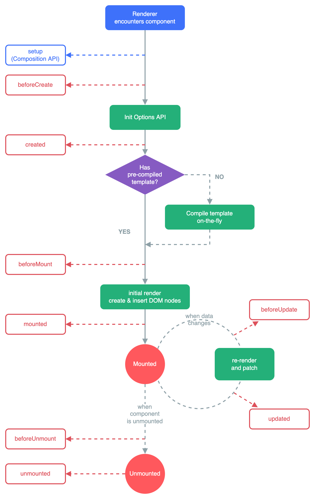

# Vue

## Summary

The strong point about Vue is how it uses its own `.vue` files. Within these files they have separated the templating, the scripting and the styling. I really like this because it keeps all the logic of a component within one file. This makes it really easy to work on styling and logic at the same time. Furthermore I have experienced the fastest idea to actual product with `Vue`

## Vue file (component)

The vue file is separated into 3 different parts the `template`, the `script` and the `style` tags with each their own functionality.

### Template

The template tag is used for entering your HTML with some cool additions from Vue like being able to use literals, having some cool conditionals like `v-if` and `v-show` and being able to render lists `v-for` this is all done in the `vue-html` form which I really enjoy and keeps things well organized. Within the template variables can also be referenced using `{{ variable }}}` syntax. This is a really convenient way to reference variables and display data from your application to the user. This combined with `computed` values can be even more powerful.

**Property binding**

Property binding is also done with it’s own syntax when you want to pass a property to a component you can do this using the following syntax

```html
<example-component :data="data" />
```

This makes it really convenient and easy to pass around data through your application while when scaling up to bigger applications I prefer to use `vuex`. Which manages state globally but this will be further discussed in another Page.

Sometimes you also want some data to be updated by an `input` or some custom component. For this `v-model` is used.

**Events**

Listening to events from a component or element also is an important part of the communication between components. For instance with `@click="method"` you can tell Vue to call the specified method from the component when a component or element is clicked. This also works for forms with the `@submit` keyword. Other event listeners are in my experience mostly used for styling purposes like removing an element from the dom on `@mouseout`. Also custom events can be used, these are emitted by the `$emit('custom-event')` syntax. For this example you would listen to this event being emitted from a component by using `@customEvent="method"`.

Events can also be extended by modifiers. These are nice to reduce the amount of code written in the method. Some handy modifiers are

- `.stop` this automatically calls `stopPropagation` before calling the method

- `.prevent` this automatically calls `preventDefault` before calling the method

- `.once` removes the event listener after the first call

There also exist events specific for key events these are

- `.enter` only calls the method when the key pressed is `enter`

- `.tab` only calls the methods when the key pressed is `tab`

- etc….

These modifiers are very simple to use the two example above would look something like this in a component

```jsx
<template>
	<div>
		<input v-model="text" @keyup.enter="submit" />
		<button @click.stop="submit">
			Submit
		</button>
	</div>
</template>

<script lang="ts">
import { defineComponent } from "vue";

export default defineComponent({
	name: "ModifiersComponent",
	data() {
		return {
			text: ""
		}
	},
	methods: {
		submit() {
			console.log(text):
		}
	}
});
</script>
```

**Slots**

Slots are a powerful tool when making a component that wraps content. A good example of how to use this is when making a `Button` component where you want the text to be inserted in a natural way you can use slots. This will be defined in the following way

```jsx
<template>
	<div class="p-4 border-2 rounded-md">
		<slot></slot>
	</div>
</template>
```

This is of course a really simple way to use slots. Slots can also be used to pass a lot more than just some text, like a whole page when you make a wrapper that sizes your webpage in the correct way.

### Script

The script tag within a Vue file houses all the logic. There are a lot of convenient ways to configure your component. I will go by each of them in each sub part

**Data**

The data keyword within the script tag is used to define data. This is the data used within the component where Vue will watch it for changes and update the component accordingly. This is why if you change some data lets say the variable `counter` is incremented. Vue will see this and update the component accordingly so the displayed variable within the template is updated. Be aware that Vue only looks if the variable is changed, so this does not work on `Object properties` this is because an object is refernece based and Vue cannot see if the object that is reference has any property value that was changed. This can be done in the **watch** part though. Defining data is done like this

```jsx
{
	data() {
		return {
			firstName: "",
			lastName: "",
			email: ""
		}
	}
}
```

**Computed**

Computed values are like data values but they are defined as a function and will update the value returned if the value used is also updated. For instance computed values are used if you want to check if multiple conditions are `true` for instance to validate a form where in the computed value you will have logic that looks similar to this

```jsx
{
	computed: {
		isValid() {
			return this.firstName && this.lastName && this.email;
		}
	}
}
```

**Props**

Properties are values passed to a component by a parent component. In the Template part of this page it is explained how to pass some data to a component. Within a component you can define the data being passed in a couple of different ways. I think the preferred way is to do type checking when defining the components. This makes it so you are sure that no weird behavior will occur that you do not expect, defining a property in this way looks something like this

```jsx
{	
	props: {
		data: {
			type: Array as () => Blog[],
			required: true
		},
		author: {
			type: String,
			required: false,
			default() {
				return ""
			}
	}
}
```

**Emits**

Emits is an array of strings where you define which events are emitted by your component. Emitting an event is done like this `this.$emit('submit-form')` when this is defined in the component the `emits` property needs to list this event as well like this

```jsx
{
	emits: ['submit-form']
}
```

Some validation can also be done in the `emits` property like this

```jsx
{
	emits: {
		'submit-form': ({ firstName, lastName, email }) => {
			return firstName && lastName && email;
		})
	}
}
```

**Hooks**

There are a multiple hooks that are called when a vue component reaches a certain life cycle. This is nice to run some code before initializing a component or by removing a listener that was added in an earlier hook. The best way to explain when each hook is called is an image so here is the image from the Vue documentation

 [^1]

The image above explains when each hook is called, as a little example of a hook that is often used (the `mounted` hook)

```jsx
{
	data() {
		return {
			cars: []
		}
	},
	async mounted() {
		const response = await fetch('http://cars.com/cars');
		const cars = await response.json();
		this.cars = cars
	}
}
```

In this case the mounted hook is used instead of the created hook because you want your web page to display content while waiting for the endpoint to respond with your data.

**Defining custom v-model**

This is not a separate property within a Vue component but it is an important feature when you want to create a feature rich library of components. To make a component able to use the attribute `v-model` it has to have a property called `modelValue` and emit and event called `update:modelValue` a really clean way to use this is like this

```jsx
{
	props: {
		modelValue: {
			type: String,
			required: true
		}
	},
  emits: ['update:modelValue'],
  computed: {
    value: {
      get() {
        return this.modelValue
      },
      set(value) {
        this.$emit('update:modelValue', value)
      }
    }
  }
}
```

To make a component even more feature rich this can be customized even more to take `v-model:firstName` as an argument for a `firstName` property this will need the prop `firstName` and the emitted event `update:firstName` defining this will look something like this.

```jsx
{
	props: {
		firstName: {
			type: String,
			required: true
		}
	},
  emits: ['update:firstName'],
  computed: {
    value: {
      get() {
        return this.firstName
      },
      set(value) {
        this.$emit('update:firstName', value)
      }
    }
  }
}
```

## Configuration

There are some other big benefits when working with Vue, like global components and global properties. This is a handy way when some components are shared between a lot of other component, e.g. and input field component. Vue supports all of this when defining the root of the application. The most useful features that I often use are:

- Defining global properties (like **isMobile**)

- Defining global components

- Defining plugins that you want to use (like `vue-router` or `vuetify`)

## Directives

Vue also supports directive that can be placed on components when defined in the parent and automatically run some code. A directive supports hooks similar to the hooks that exist on a component. Directive are useful when little custom logic is needed

Source: [https://vuejs.org/](https://vuejs.org/) 

[^1]: Renderer
    encounters component
    setup
    Composition API)
    beforeCreate
    Init Options API
    created
    Has
    pre-compiled
    NO
    template?
    Compile template
    on-the-fly
    YES
    beforeMount
    initial render
    create & insert DOM nodes
    beforeUpdate
    when data
    mounted
    changes
    Mounted
    re-render
    and patch
    when
    component
    is unmounted
    updated
    beforeUnmount
    unmounted
    Unmounted

